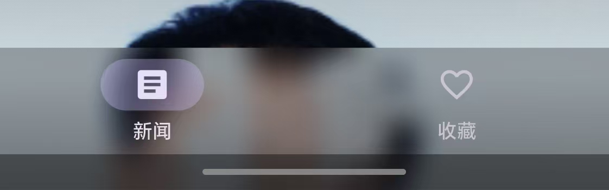

# 闻天下 · Flutter 新闻阅读 App

> Material 3 + 高斯模糊（毛玻璃）+ 短视频式垂直滑动浏览的新闻阅读应用。
> 数据源为**聚合数据 · 新闻头条 API**；**API Key 由用户在首次启动时填写并只保存在本机**
> （Hive 本地存储），源码中不含任何硬编码密钥。

<p align="left">
  
  
  
  
  
  
  
</p>

---

## 版本记录

| 版本 | 说明 |
| --- | --- |
| **1.0.1+2**（当前） | **修复毛玻璃控件下方图像缺失（空白色带）与滑动闪烁**；毛玻璃层结构重构；新增模糊回归测试；README 补充技术实现与源码 |
| 1.0.0+1 | 首个版本：引导页 / 新闻流 / 全文阅读 / 收藏 / 设置 / CodeMagic 构建 |

### 1.0.1 修复详情



**现象**：所有毛玻璃控件（底部导航栏、顶部栏、全文页操作栏、收藏卡片、Chip 等）
下方会出现一块**图像缺失的空白/灰白色带**，滑动时还会**闪烁**。

**根因**：`BackdropFilter` 属于 **backdrop 层**——它必须采样「自己下方已经画好的像素」。
1.0.0 里为了“避免模糊引发重绘”，在每个毛玻璃控件外面包了 `RepaintBoundary`：

```dart
// ❌ 1.0.0 的写法（有 bug）
RepaintBoundary(            // ← 把子树提升为独立 OffsetLayer
  child: ClipRRect(
    child: BackdropFilter(  // ← backdrop 采样范围被截断在这个独立层内
      filter: ImageFilter.blur(sigmaX: 10, sigmaY: 10),
      child: Container(...),//   层内只有半透明控件本身 → 采到空白 → 色带
    ),
  ),
)
```

子树被提升为独立层后，backdrop 只能拿到**该层内部**的像素（往往只有半透明控件本身），
于是模糊区域下方出现空洞；滑动时该层又被光栅缓存复用，空洞就表现为闪烁。

**修复**（4 处结构性改动）：

| # | 改动 | 文件 |
| --- | --- | --- |
| 1 | 毛玻璃控件**不再包** `RepaintBoundary`；需要隔离重绘时，把边界放在**整块滚动内容**的上一层 | `blur_container.dart`、`news_card.dart`、`interest_selector.dart`、`news_feed_page.dart`、`article_detail_page.dart` |
| 2 | 新增 `GlassBackdrop`：每个界面 `Stack` 最底层铺一层全屏渐变，保证模糊区域下方**永远有已绘制的像素**（内容不足一屏时也不再出现空白带） | `blur_container.dart` + 各页面 |
| 3 | 一条 bar 只做**一次**模糊：条内小按钮改用 `GlassTint`（静态半透明填充，不新增 backdrop 层），消除“模糊套模糊”的多层采样 | `BlurBar` / `GlassTint` / `BlurButton(flat: true)` |
| 4 | 顶栏/底栏改用 `Clip.hardEdge` 矩形裁剪 + 渐隐底色；`NavigationBar` 去掉外层 `RepaintBoundary` | `main_shell.dart`、`news_feed_page.dart`、`article_detail_page.dart` |

修复后的层结构（正确形态）：

```dart
Stack(children: <Widget>[
  const GlassBackdrop(),                  // ① 兜底：全屏渐变（永远有像素）
  Positioned.fill(child: RepaintBoundary( // ② 采样源：整块滚动内容作为一个稳定层
    child: content,
  )),
  ClipRect(                               // ③ 毛玻璃控件：Clip → BackdropFilter → Container
    clipBehavior: Clip.hardEdge,
    child: BackdropFilter(
      filter: ImageFilter.blur(sigmaX: 10, sigmaY: 10),
      child: Container(...),
    ),
  ),
])
```

回归测试 `test/blur_regression_test.dart` 会断言
**`BackdropFilter` 的祖先链上不允许出现 `RepaintBoundary`**，防止该 bug 再次引入。

---

## 目录

- [一、功能总览](#一功能总览)
- [二、技术栈与版本组合](#二技术栈与版本组合)
- [三、快速开始](#三快速开始)
- [四、目录结构](#四目录结构)
- [五、架构与数据流](#五架构与数据流)
- [六、核心实现详解（含代码）](#六核心实现详解含代码)
  - [6.1 首次启动判断：Hive + go_router redirect](#61-首次启动判断hive--go_router-redirect)
  - [6.2 引导页：API Key 输入 + 兴趣 Chip](#62-引导页api-key-输入--兴趣-chip)
  - [6.3 Hive 本地存储封装](#63-hive-本地存储封装)
  - [6.4 数据模型：Freezed + Hive](#64-数据模型freezed--hive)
  - [6.5 仓库层：从 Hive 读 Key 请求聚合数据](#65-仓库层从-hive-读-key-请求聚合数据)
  - [6.6 新闻流：垂直 PageView + 上滑刷新](#66-新闻流垂直-pageview--上滑刷新)
  - [6.7 单条新闻卡片布局](#67-单条新闻卡片布局)
  - [6.8 全文阅读：过渡动画 + 自动滚动](#68-全文阅读过渡动画--自动滚动)
  - [6.9 正文抽取：ArticleHtmlParser](#69-正文抽取articlehtmlparser)
  - [6.10 收藏：Hive Box + 左滑删除](#610-收藏hive-box--左滑删除)
  - [6.11 高斯模糊规范（BlurContainer）](#611-高斯模糊规范blurcontainer)
  - [6.12 Material 3 主题](#612-material-3-主题)
  - [6.13 原生分享 MethodChannel](#613-原生分享-methodchannel)
- [七、聚合数据 API 说明](#七聚合数据-api-说明)
- [八、CodeMagic 构建](#八codemagic-构建)
- [九、测试](#九测试)
- [十、验收对照表](#十验收对照表)
- [十一、常见问题与取舍](#十一常见问题与取舍)

---

## 一、功能总览

| 模块 | 实现要点 |
| --- | --- |
| **首次启动引导** | 两步引导：①「聚合新闻API Key」输入（非空 + 长度校验、一键粘贴、官网申请入口）②兴趣类别多选（Material 3 `Chip` + 高斯模糊容器）。保存 `isFirstLaunch=false` / `apiKey` / `selectedCategories` |
| **启动判断** | `main()` 初始化 Hive → `settingsProvider` 推送本地设置 → `go_router.redirect` 决定进引导页还是主界面（第二次启动不再展示引导页） |
| **新闻滑动浏览** | `PageView` + `scrollDirection: Axis.vertical`；每页：图片（约 38% 屏高）→ 标题（`headlineSmall`）→ 简介（`bodyMedium`，2~3 句）→「观看全文」毛玻璃按钮 |
| **上滑刷新** | 在第一条新闻处继续向下拖拽（`OverscrollNotification`）触发接口重拉；另有毛玻璃刷新按钮 + `RefreshIndicator` |
| **全文阅读** | `CustomTransitionPage` + `SlideTransition`/`FadeTransition`；进入后 `Timer`+`ScrollController` **自动滚动**（0.5x/1x/1.5x/2x，可暂停）；顶部阅读进度条；页内至少一张图片；显示作者/来源/发布时间/字数 |
| **阅读原文** | `url_launcher` 打开系统浏览器（已声明 Android `<queries>`） |
| **收藏** | 心形图标 `Icons.favorite_border ↔ Icons.favorite`；Hive `Box<NewsArticle>` 持久化；收藏 Tab 显示缩略图/标题/收藏时间，`Dismissible` 左滑删除（带撤销）、一键清空；空状态「还没有收藏的新闻」 |
| **设置页** | 随时修改 API Key / 兴趣频道，保存后自动刷新新闻 |
| **错误处理** | Material 3 `SnackBar` + 重试；聚合数据错误码（10001 无效 Key、10012 额度用尽…）映射为中文提示 |
| **分享 / 跳转** | 全文页底部毛玻璃操作栏：阅读原文 / 收藏 / 分享（原生 `MethodChannel` 调系统分享面板，无第三方插件） |

---

## 二、技术栈与版本组合

| 类别 | 选型 | 版本 |
| --- | --- | --- |
| 框架 | Flutter（Material 3 默认启用） | 3.27.4 / Dart 3.6.2 |
| 状态管理 | Riverpod | `flutter_riverpod ^2.6.1` |
| 网络 | Dio | `^5.7.0` |
| 本地存储 | Hive + hive_flutter | `^2.2.3` / `^1.1.0` |
| 路由 | go_router（`StatefulShellRoute.indexedStack`） | `^14.6.2` |
| 模型生成 | Freezed 2.5.7 + json_serializable 6.9.0 + hive_generator 2.0.1 | 见下 |
| 浏览器跳转 | url_launcher | `^6.3.0` |
| 图片加载 | cached_network_image | `^3.4.1` |
| 其他 | intl（时间格式化）、path_provider | `^0.19.0` / `^2.1.4` |

Android 侧（`android/settings.gradle`、`android/app/build.gradle`）:

| 组件 | 版本 |
| --- | --- |
| Gradle / AGP / Kotlin | 8.7 / 8.6.0 / 1.9.24 |
| compileSdk / targetSdk / minSdk | 35 / 35 / 23 |
| Java source·target | 17（CodeMagic: `java: 17`） |
| applicationId / namespace | `com.wentianxia.news` |

> ⚠️ **`freezed` 为什么锁定 2.5.7**
> `hive_generator 2.0.1` 依赖 `source_gen ^1.x`，而 `freezed >= 2.5.8` 依赖 `source_gen ^2.x`，
> 二者无法共存（`flutter pub get` 会直接给出 "version solving failed"）。
> 因此 `pubspec.yaml` 用 `freezed: 2.5.7` + `hive_generator: ^2.0.1`，这也是能同时生成
> `*.freezed.dart` 与 `*.g.dart`（Hive Adapter）的最低代价方案。

---

## 三、快速开始

```bash
flutter --version    # 需 3.27.x（Dart 3.6.x）

# 1. 依赖
flutter pub get

# 2. 代码生成（*.freezed.dart / *.g.dart；仓库中已提交生成结果，可跳过）
dart run build_runner build --delete-conflicting-outputs

# 3. 静态检查 + 测试
flutter analyze     # 期望：No issues found!
flutter test        # 期望：All tests passed!（12 个用例）

# 4. 运行 / 打包（Android）
flutter run
flutter build apk --release
# 产物：build/app/outputs/flutter-apk/app-release.apk（版本 1.0.1+2）
```

首次启动 App → 粘贴聚合数据 API Key → 选兴趣频道 → 进入新闻流。
（Key 也可之后在「设置」中修改。）

---

## 四、目录结构

```
lib/
├── main.dart                          # Hive 初始化 → ProviderScope → runApp
├── app.dart                           # MaterialApp.router（Material 3 / 深色主题）
├── routes/
│   ├── app_router.dart                # go_router 配置 + redirect（首启判断）
│   └── main_shell.dart                # 毛玻璃 NavigationBar（新闻 / 收藏）
├── core/
│   ├── errors/news_api_exception.dart # 统一业务异常
│   ├── services/share_service.dart    # 原生分享 MethodChannel
│   ├── theme/app_theme.dart           # ColorScheme.fromSeed(deepPurple)
│   └── widgets/
│       ├── blur_container.dart        # 高斯模糊容器 / 毛玻璃按钮 / BlurGroup
│       └── news_network_image.dart    # CachedNetworkImage + placeholder + errorWidget
├── features/
│   ├── onboarding/
│   │   ├── providers/onboarding_provider.dart   # 勾选状态 + 保存到 Hive
│   │   ├── views/onboarding_page.dart           # 两步引导页
│   │   └── widgets/interest_selector.dart       # Chip 兴趣选择（毛玻璃）
│   ├── news/
│   │   ├── data/news_channels.dart              # 14 个频道（type ↔ 中文名）
│   │   ├── models/news_article.dart             # Freezed + Hive（+ .freezed/.g）
│   │   ├── models/article_content.dart          # 全文页内容结构
│   │   ├── repositories/news_repository.dart    # 聚合数据 API（Key 从 Hive 读）
│   │   ├── services/article_html_parser.dart    # 原文正文抽取（零依赖）
│   │   ├── providers/news_provider.dart         # 新闻流状态机
│   │   └── views/
│   │       ├── news_feed_page.dart              # 主滑动页（垂直 PageView）
│   │       ├── news_card.dart                   # 单条新闻卡片
│   │       └── article_detail_page.dart         # 全文阅读页（自动滚动）
│   ├── favorites/
│   │   ├── providers/favorites_provider.dart    # Hive watch → 自动刷新
│   │   └── views/favorites_page.dart            # 收藏列表（左滑删除）
│   └── settings/views/settings_page.dart        # 修改 Key / 兴趣
└── shared/hive/
    ├── hive_service.dart              # Hive 初始化与读写封装
    ├── app_settings.dart              # API Key / 兴趣 / 首启标记（typeId 1）
    └── settings_provider.dart         # 设置流 + 保存动作
```

---

## 五、架构与数据流

采用 **MVVM + Riverpod**：

```
UI (View / ConsumerWidget)
      │  ref.watch / ref.read
      ▼
Provider / Notifier（状态与业务编排）
      │
      ▼
Repository（NewsRepository / HiveService）
      ├── Dio  → 聚合数据 https://v.juhe.cn/toutiao/index
      └── Hive → apiKey / selectedCategories / 收藏
      │
      ▼
模型（NewsArticle / ArticleContent）→ 状态更新 → UI 自动重建
```

三条关键数据流：

| 流程 | 链路 |
| --- | --- |
| 新闻加载 | `newsFeedControllerProvider.load()` → `NewsRepository.fetchArticles()` → 读 Hive 的 Key → Dio 请求 → `NewsArticle` 列表 → `NewsFeedState` → `PageView` 重建 |
| 收藏 | 心形按钮 → `favoritesProvider.toggle()` → `HiveService.toggleFavorite()` 写 `Box<NewsArticle>` → Box `watch()` 流 → `FavoritesController` 更新 → 收藏页与卡片图标同步刷新 |
| 首次启动 | `main()` 初始化 Hive → `settingsProvider`（`StreamProvider`）→ `go_router.refreshListenable` → `redirect` 判断 `isFirstLaunch / apiKey` |

---

## 六、核心实现详解（含代码）

### 6.1 首次启动判断：Hive + go_router redirect

`lib/main.dart`（Hive 必须在 `runApp` 之前初始化；未捕获异常兜底避免 release 白屏）：

```dart
Future<void> main() async {
  WidgetsFlutterBinding.ensureInitialized();

  FlutterError.onError = (FlutterErrorDetails details) => FlutterError.presentError(details);
  PlatformDispatcher.instance.onError = (Object error, StackTrace stack) {
    debugPrint('未捕获异常: $error');
    return true;
  };

  await SystemChrome.setEnabledSystemUIMode(SystemUiMode.edgeToEdge, overlays: SystemUiOverlay.values);
  SystemChrome.setSystemUIOverlayStyle(AppTheme.systemOverlayStyle);

  // Hive 落在应用私有目录（Android: /data/data/com.wentianxia.news/app_flutter）
  await Hive.initFlutter('wentianxia_db');
  await HiveService.instance.init();

  runApp(
    ProviderScope(
      overrides: <Override>[hiveServiceProvider.overrideWithValue(HiveService.instance)],
      child: const WentianxiaApp(),
    ),
  );
}
```

`lib/routes/app_router.dart`（把设置变化桥接成 `Listenable` 驱动 redirect）：

```dart
final Provider<GoRouterConfig> appRouterProvider = Provider<GoRouterConfig>((Ref ref) {
  final _SettingsNotifier listenable = _SettingsNotifier(ref);
  ref.onDispose(listenable.dispose);

  final GoRouter router = GoRouter(
    initialLocation: AppRoutes.splash,
    refreshListenable: listenable,          // ← Hive 设置一变就重算 redirect
    redirect: (BuildContext context, GoRouterState state) {
      final AsyncValue<AppSettings> settingsAsync = ref.read(settingsProvider);
      if (settingsAsync.isLoading && !settingsAsync.hasValue) return null; // 启动页

      final AppSettings? settings = settingsAsync.valueOrNull;
      // 首次启动（isFirstLaunch == true）或未填写 API Key → 必须走引导页
      final bool needOnboarding = settings == null ||
          settings.isFirstLaunch || !settings.hasApiKey;

      final bool atOnboarding = state.matchedLocation == AppRoutes.onboarding;
      if (needOnboarding) return atOnboarding ? null : AppRoutes.onboarding;
      if (atOnboarding || state.matchedLocation == AppRoutes.splash) return AppRoutes.news;
      return null;
    },
    routes: <RouteBase>[ /* splash / onboarding / settings / article / StatefulShellRoute */ ],
  );
  return GoRouterConfig(router: router, listenable: listenable);
});
```

### 6.2 引导页：API Key 输入 + 兴趣 Chip

`lib/features/onboarding/views/onboarding_page.dart`（非空校验 + 一键粘贴）：

```dart
BlurContainer(                                   // 高斯模糊包裹输入框
  borderRadius: BorderRadius.circular(18),
  blur: 10,
  opacity: 0.14,
  padding: const EdgeInsets.symmetric(horizontal: 16, vertical: 6),
  child: TextFormField(
    controller: _keyController,
    keyboardType: TextInputType.visiblePassword,
    autocorrect: false,
    enableSuggestions: false,
    decoration: InputDecoration(
      border: InputBorder.none,
      labelText: '聚合新闻API Key',
      hintText: '例如：a1b2c3d4e5f6...',
      helperText: '申请地址：juhe.cn（新闻头条 API，免费 50 次/天）',
      prefixIcon: const Icon(Icons.vpn_key_outlined),
      suffixIcon: IconButton(                          // 一键从剪贴板粘贴
        tooltip: '粘贴',
        icon: const Icon(Icons.content_paste),
        onPressed: () async {
          final ClipboardData? data = await Clipboard.getData(Clipboard.kTextPlain);
          final String? text = data?.text?.trim();
          if (text == null || text.isEmpty) { _snack('剪贴板中没有文本'); return; }
          _keyController.text = text;
        },
      ),
    ),
    validator: (String? value) {
      if (value == null || value.trim().isEmpty) return 'API Key 不能为空，请输入聚合数据密钥';
      if (value.trim().length < 8) return 'API Key 长度过短，请检查是否复制完整';
      return null;
    },
  ),
)
```

兴趣选择（每个 `Chip` 外层都是高斯模糊容器，模糊强度按频道哈希在 10~14 之间微调形成层次感）：

```dart
// lib/features/onboarding/widgets/interest_selector.dart
Wrap(
  spacing: 10,
  runSpacing: 10,
  children: channels.map((NewsChannel channel) {
    final bool isSelected = selected.contains(channel.type);
    final double sigma = 10 + (channel.type.hashCode % 5);
    return RepaintBoundary(
      child: BlurContainer(
        borderRadius: BorderRadius.circular(24),
        blur: sigma,
        opacity: isSelected ? 0.34 : 0.12,
        tint: isSelected ? colors.primary : colors.surface,
        child: Material(
          color: Colors.transparent,
          child: InkWell(
            borderRadius: BorderRadius.circular(24),
            onTap: () => onToggle(channel.type),
            child: Padding(
              padding: const EdgeInsets.symmetric(horizontal: 14, vertical: 9),
              child: Row(mainAxisSize: MainAxisSize.min, children: <Widget>[
                Text(channel.icon), const SizedBox(width: 6), Text(channel.label),
                if (isSelected) ...<Widget>[const SizedBox(width: 6), const Icon(Icons.check_circle, size: 16)],
              ]),
            ),
          ),
        ),
      ),
    );
  }).toList(),
)
```

保存到 Hive（`isFirstLaunch` 置 false，写入 Key 与兴趣）：

```dart
// lib/features/onboarding/providers/onboarding_provider.dart
Future<bool> complete({required String apiKey}) async {
  final String key = apiKey.trim();
  if (key.isEmpty) { state = state.copyWith(error: 'API Key 不能为空'); return false; }

  final Set<String> selected = state.selectedCategories.isEmpty
      ? <String>{kAllChannels.first.type}
      : state.selectedCategories;

  state = state.copyWith(saving: true, clearError: true);
  await _hive.completeOnboarding(apiKey: key, categories: selected.toList(growable: false));
  state = state.copyWith(saving: false, selectedCategories: selected);
  return true;
}
```

### 6.3 Hive 本地存储封装

`lib/shared/hive/hive_service.dart`（三个 Box：设置 / 收藏 / 元数据；写操作都 `flush()`）：

```dart
class HiveService {
  static const String settingsBoxName  = 'wentianxia_settings';
  static const String favoritesBoxName = 'wentianxia_favorites';
  static const String metaBoxName      = 'wentianxia_meta';
  static const String settingsKey      = 'app_settings';

  late Box<AppSettings> settingsBox;
  late Box<NewsArticle> favoritesBox;
  late Box<dynamic> metaBox;

  Future<void> init() async {
    if (!Hive.isAdapterRegistered(1)) Hive.registerAdapter(AppSettingsAdapter());
    if (!Hive.isAdapterRegistered(2)) Hive.registerAdapter(NewsArticleAdapter());

    settingsBox  = await Hive.openBox<AppSettings>(settingsBoxName);
    favoritesBox = await Hive.openBox<NewsArticle>(favoritesBoxName);
    metaBox      = await Hive.openBox<dynamic>(metaBoxName);

    if (settingsBox.get(settingsKey) == null) {
      await settingsBox.put(settingsKey, AppSettings());
    }
    _initialized = true;
  }

  /// 引导页完成：写 apiKey / selectedCategories 并把 isFirstLaunch 置 false
  Future<AppSettings> completeOnboarding({
    required String apiKey, required List<String> categories,
  }) async {
    final AppSettings next = readSettings().copyWith(
      apiKey: apiKey.trim(),
      selectedCategories: List<String>.of(categories),
      isFirstLaunch: false,
      onboardingCompletedAt: DateTime.now(),
    );
    await saveSettings(next);
    return next;
  }

  /// 请求新闻时从这里读取 API Key（不硬编码在任何地方）
  String get apiKey => readSettings().apiKey.trim();

  /// 收藏 / 取消收藏
  Future<bool> toggleFavorite(NewsArticle article) async {
    final int? existingKey = findFavoriteKey(article.key);
    if (existingKey != null) {
      await favoritesBox.delete(existingKey);
      await favoritesBox.flush();
      return false;
    }
    final NewsArticle stored = article.copyWith(favoritedAt: DateTime.now(), hiveKey: null);
    final int key = await favoritesBox.add(stored);
    await favoritesBox.put(key, stored.copyWith(hiveKey: key));
    await favoritesBox.flush();
    return true;
  }
}

/// main.dart 中用 HiveService.instance 覆盖
final Provider<HiveService> hiveServiceProvider = Provider<HiveService>(
  (Ref ref) => throw UnimplementedError('必须在 ProviderScope 中覆盖为 HiveService.instance'),
);
```

设置流（`StreamProvider` + Box `watch()`，供路由与设置页使用）：

```dart
// lib/shared/hive/settings_provider.dart
final StreamProvider<AppSettings> settingsProvider = StreamProvider<AppSettings>((Ref ref) {
  final HiveService hive = ref.watch(hiveServiceProvider);

  Stream<AppSettings> watch() async* {
    yield hive.readSettings();                                  // 立即给出当前值
    yield* hive.settingsBox.watch().map((BoxEvent _) => hive.readSettings());
  }

  return watch();
});
```

### 6.4 数据模型：Freezed + Hive

`lib/features/news/models/news_article.dart`（Freezed 生成 `copyWith/==/toString`，hive_generator 生成 Adapter）：

```dart
@HiveType(typeId: 2)
@freezed
class NewsArticle with _$NewsArticle {
  const factory NewsArticle({
    @HiveField(0) String? id,                                  // uniquekey / 兜底哈希
    @HiveField(1) @JsonKey(name: 'title') required String title,
    @HiveField(2) @JsonKey(name: 'author_name') @Default('') String author,
    @HiveField(3) @JsonKey(name: 'date') @Default('') String publishedAt,
    @HiveField(4) @JsonKey(name: 'thumbnail_pic_s') @Default('') String thumbnailUrl,
    @HiveField(5) @JsonKey(name: 'thumbnail_pic_s02') @Default('') String imageUrl2,
    @HiveField(6) @JsonKey(name: 'thumbnail_pic_s03') @Default('') String imageUrl3,
    @HiveField(7) @JsonKey(name: 'url') @Default('') String url,
    @HiveField(8) @JsonKey(name: 'category') @Default('top') String category,
    @HiveField(9) @JsonKey(name: 'description') @Default('') String summary,
    @HiveField(11) DateTime? favoritedAt,                      // 未收藏 = null
    @HiveField(12) @JsonKey(includeFromJson: false, includeToJson: false) int? hiveKey,
  }) = _NewsArticle;

  const NewsArticle._();

  factory NewsArticle.fromJson(Map<String, dynamic> json) => _$NewsArticleFromJson(json);

  List<String> get images => <String>[thumbnailUrl, imageUrl2, imageUrl3]
      .where((String u) => u.trim().isNotEmpty).toList(growable: false);

  bool get hasImage => images.isNotEmpty;
  bool get isFavorite => favoritedAt != null;

  /// 稳定标识：接口没有 id 时用 url/标题哈希（保证同一新闻不会重复收藏）
  String get key {
    final String raw = (id ?? '').trim();
    return raw.isNotEmpty ? raw : fallbackId(url, title);
  }

  /// 需求条目 5：简介为空时截取正文前 200 字符
  String defaultSummary([String? body]) {
    final String source = (body ?? '').replaceAll(RegExp(r'\s+'), ' ').trim();
    if (source.isEmpty) {
      return '$title。来源：${author.isEmpty ? '网络媒体' : author}，点击「观看全文」查看完整报道。';
    }
    return source.length <= 200 ? source : '${source.substring(0, 200)}…';
  }

  static String fallbackId(String url, String title) =>
      'a${Object.hash(url.isEmpty ? title : url, title).abs()}';
}
```

生成的 Hive Adapter（`news_article.g.dart`，节选）：

```dart
class NewsArticleAdapter extends TypeAdapter<NewsArticle> {
  @override
  final int typeId = 2;

  @override
  NewsArticle read(BinaryReader reader) {
    final numOfFields = reader.readByte();
    final fields = <int, dynamic>{
      for (int i = 0; i < numOfFields; i++) reader.readByte(): reader.read(),
    };
    return NewsArticle(
      id: fields[0] as String?, title: fields[1] as String, author: fields[2] as String,
      publishedAt: fields[3] as String, thumbnailUrl: fields[4] as String,
      imageUrl2: fields[5] as String, imageUrl3: fields[6] as String,
      url: fields[7] as String, category: fields[8] as String, summary: fields[9] as String,
      favoritedAt: fields[11] as DateTime?, hiveKey: fields[12] as int?,
    );
  }

  @override
  void write(BinaryWriter writer, NewsArticle obj) { /* ... 按字段号写入 ... */ }
}
```

### 6.5 仓库层：从 Hive 读 Key 请求聚合数据

`lib/features/news/repositories/news_repository.dart`：

```dart
const String kJuheToutiaoEndpoint = 'https://v.juhe.cn/toutiao/index';
const String kTheNewsApiEndpoint  = 'https://api.thenewsapi.com/v1/news/top';

Future<List<NewsArticle>> fetchArticles({List<String>? categories}) async {
  final String key = apiKey;                                  // ← 运行时从 Hive 读取
  if (key.isEmpty) {
    throw const NewsApiException('尚未配置聚合新闻 API Key，请先完成引导设置。');
  }

  final List<String> types = _resolveCategories(categories);

  // 备选方案：Key 写成 `thenewsapi:<token>` 时切换数据源
  if (key.toLowerCase().startsWith('thenewsapi:')) {
    final List<NewsArticle> alt =
        await _fetchTheNewsApi(key.substring('thenewsapi:'.length).trim(), types.first);
    await _hive.setLastRefresh(DateTime.now());
    return alt;
  }

  final List<List<NewsArticle>> results = <List<NewsArticle>>[];
  NewsApiException? lastError;
  for (final String type in types) {
    try {
      results.add(await _fetchJuhe(type, key));
    } on NewsApiException catch (e) {
      lastError = e;                                          // 单频道失败不整体失败
    }
  }
  if (results.isEmpty) {
    throw lastError ?? const NewsApiException('新闻接口暂时不可用，请稍后重试。');
  }

  final List<NewsArticle> merged = _mergeInterleaved(results); // 多频道交替合并
  await _hive.setLastRefresh(DateTime.now());
  return merged;
}

Future<List<NewsArticle>> _fetchJuhe(String type, String key) async {
  final Response<dynamic> res = await _dio.get<dynamic>(
    kJuheToutiaoEndpoint,
    queryParameters: <String, dynamic>{
      'type': type, 'key': key, 'page': 1, 'page_size': 30, 'is_filter': 1,
    },
  );

  final Map<String, dynamic>? body = _asMap(res.data);
  final int? code = _asInt(body?['error_code']);
  if (code != 0) {
    throw NewsApiException(
      _friendlyMessage(code, body?['reason']?.toString() ?? '请求失败'),
      code: code,
      isRateLimited: code == 10012 || code == 10001 || code == 10002,
    );
  }
  return _mapArticles(_asList(_asMap(body?['result'])?['data']), type);
}

/// 错误码 → 中文提示
String _friendlyMessage(int? code, String reason) {
  switch (code) {
    case 10001: case 10002: case 10003: case 10004:
      return 'API Key 无效或已过期（$reason），请到「设置」中重新填写聚合数据密钥。';
    case 10012:
      return '今日接口调用次数已用完（免费额度 50 次/天），请明天再试。';
    case 10020:
      return '接口维护中，请稍后再试。';
    default:
      return '新闻获取失败：$reason';
  }
}

/// 频道去重 + 最多 3 个（控制每日 50 次免费额度）
List<String> _resolveCategories(List<String>? categories) {
  final List<String> source = (categories == null || categories.isEmpty)
      ? settings.effectiveCategories : categories;
  final Iterable<String> normalized =
      source.map<String>(normalizeChannelType).where((String t) => t.trim().isNotEmpty);
  final List<String> unique = normalized.toSet().toList(growable: false);
  return unique.isEmpty ? <String>['top'] : unique.take(3).toList();
}
```

字段归一化：兼容聚合数据与非标准字段名，并把 `id` / `category` 注入后再交给 Freezed：

```dart
final Map<String, dynamic> normalized = <String, dynamic>{
  ...json,
  'category': type,
  'url':   (json['url'] ?? json['link'] ?? json['source_url'] ?? '').toString(),
  'title': (json['title'] ?? json['headline'] ?? '').toString(),
};
final String id = (json['uniquekey'] ?? json['uuid'] ?? json['id'])?.toString().trim()
    ?? NewsArticle.fallbackId(url, title);
normalized['id'] = id;
normalized['thumbnail_pic_s'] = (json['thumbnail_pic_s'] ?? json['image_url'] ?? json['image'] ?? '').toString();
normalized['author_name']     = (json['author_name'] ?? json['source'] ?? json['author'] ?? '').toString();
normalized['description']     = (json['description'] ?? json['snippet'] ?? json['summary'] ?? '').toString();
```

### 6.6 新闻流：垂直 PageView + 上滑刷新

`lib/features/news/providers/news_provider.dart`（状态机）：

```dart
@immutable
class NewsFeedState {
  const NewsFeedState({
    this.articles = const <NewsArticle>[], this.currentIndex = 0,
    this.isLoading = false, this.isRefreshing = false, this.error,
  });

  final List<NewsArticle> articles;
  final int currentIndex;
  final bool isLoading, isRefreshing;
  final String? error;

  NewsArticle? get current =>
      (currentIndex >= 0 && currentIndex < articles.length) ? articles[currentIndex] : null;
}

class NewsFeedController extends StateNotifier<NewsFeedState> {
  NewsFeedController(this._ref) : super(const NewsFeedState()) { load(); } // 构造即加载

  Future<void> load() async { /* 首屏加载（骨架屏） */ }
  Future<void> refresh() async { /* 下拉刷新：重新请求接口 */ }
  Future<void> loadCategory(String type, {bool keepCurrent = false}) async { /* 切换频道 */ }
  void onPageChanged(int index) => state = state.copyWith(currentIndex: index);
}

final StateNotifierProvider<NewsFeedController, NewsFeedState> newsFeedControllerProvider =
    StateNotifierProvider<NewsFeedController, NewsFeedState>((Ref ref) => NewsFeedController(ref));
```

`lib/features/news/views/news_feed_page.dart`（上滑/下拉刷新 + 垂直 PageView）：

```dart
/// 首条新闻继续下滑 → 触发刷新
bool _onScrollNotification(ScrollNotification notification) {
  if (notification.depth != 0) return false;
  if (notification is! OverscrollNotification) return false;   // 只认越界拖拽
  final bool pullingDown = notification.overscroll < 0;
  if (!pullingDown || _refreshTriggered) return false;
  if (_pageController.hasClients && _pageController.page != null) {
    if (_pageController.page!.round() != 0) return false;      // 仅在第一条生效
  }
  _refreshTriggered = true;
  _refresh();                                                  // 重新调用 API
  return false;
}

// build 中：
Positioned.fill(
  child: RefreshIndicator(
    onRefresh: _refresh,
    child: NotificationListener<ScrollNotification>(
      onNotification: _onScrollNotification,
      child: _buildBody(state),
    ),
  ),
),

PageView.builder(
  controller: _pageController,
  scrollDirection: Axis.vertical,                              // ← 短视频式上下切换
  physics: const AlwaysScrollableScrollPhysics(parent: BouncingScrollPhysics()),
  itemCount: state.articles.length,
  onPageChanged: (int index) {
    _refreshTriggered = false;                                 // 回到首条可再次触发
    ref.read(newsFeedControllerProvider.notifier).onPageChanged(index);
  },
  itemBuilder: (BuildContext context, int index) => NewsCard(
    key: ValueKey<String>(state.articles[index].key),
    article: state.articles[index],
    index: index,
  ),
)
```

错误提示与重试（`ref.listen` 只弹一次 SnackBar）：

```dart
ref.listen<String?>(
  newsFeedControllerProvider.select((NewsFeedState s) => s.error),
  (String? previous, String? next) {
    if (next != null && next != previous) {
      _showSnack(next);                                        // SnackBar + 「重试」按钮
      ref.read(newsFeedControllerProvider.notifier).consumeError();
    }
  },
);
```

### 6.7 单条新闻卡片布局

`lib/features/news/views/news_card.dart`（图片 38% 屏高 → 标题 → 简介 → 毛玻璃按钮 + 收藏）：

```dart
final double imageHeight = MediaQuery.sizeOf(context).height * 0.38;

Stack(fit: StackFit.expand, children: <Widget>[
  Hero(
    tag: 'article-image-${article.key}',
    child: NewsNetworkImage(url: article.thumbnailUrl, height: imageHeight, fallbackSeed: index),
  ),
  Positioned.fill(child: DecoratedBox(decoration: BoxDecoration(
    gradient: LinearGradient(begin: Alignment.topCenter, end: Alignment.bottomCenter,
      stops: const <double>[0, 0.28, 0.55, 1],
      colors: <Color>[Colors.black54, Colors.black12, Colors.black, Colors.black]),
  ))),
  Positioned(left: 0, right: 0, bottom: 0, child: Padding(
    padding: const EdgeInsets.fromLTRB(20, 0, 20, 104),           // 底部留出导航栏高度
    child: Column(mainAxisSize: MainAxisSize.min, crossAxisAlignment: CrossAxisAlignment.start,
      children: <Widget>[
        _CategoryTag(channel: channel, publishedAt: article.publishedAt),
        const SizedBox(height: 12),
        Text(article.title, maxLines: 3, overflow: TextOverflow.ellipsis,
             style: theme.textTheme.headlineSmall?.copyWith(color: Colors.white)),
        const SizedBox(height: 10),
        // 来源行 ...
        Text(article.displaySummary, maxLines: 3, overflow: TextOverflow.ellipsis,
             style: theme.textTheme.bodyMedium?.copyWith(color: Colors.white.withValues(alpha: 0.86))),
        const SizedBox(height: 18),
        Row(children: <Widget>[
          BlurButton(
            label: '观看全文', icon: Icons.menu_book_outlined, opacity: 0.2,
            foregroundColor: Colors.white,
            onPressed: () => context.push('${AppRoutes.article}?id=${article.key}', extra: article),
          ),
          const Spacer(),
          _RoundIconButton(                                       // 收藏心形（毛玻璃圆钮）
            icon: favorite ? Icons.favorite : Icons.favorite_border,
            color: favorite ? const Color(0xFFFF5C8A) : Colors.white,
            onPressed: () => _toggleFavorite(context, ref),
          ),
        ]),
      ]),
  )),
])
```

### 6.8 全文阅读：过渡动画 + 自动滚动

路由过渡（`lib/routes/app_router.dart`，`CustomTransitionPage` + Fade/Slide）：

```dart
GoRoute(
  path: AppRoutes.article,
  name: 'article',
  pageBuilder: (BuildContext context, GoRouterState state) {
    final NewsArticle? article = state.extra is NewsArticle ? state.extra! as NewsArticle : null;
    return CustomTransitionPage<void>(
      key: state.pageKey,
      fullscreenDialog: true,
      transitionDuration: const Duration(milliseconds: 380),
      reverseTransitionDuration: const Duration(milliseconds: 300),
      child: ArticleDetailPage(article: article, articleId: state.uri.queryParameters['id']),
      transitionsBuilder: (context, animation, secondaryAnimation, child) {
        final Animation<double> curved = CurvedAnimation(
          parent: animation, curve: Curves.easeOutCubic, reverseCurve: Curves.easeInCubic);
        return FadeTransition(opacity: curved, child: SlideTransition(
          position: Tween<Offset>(begin: const Offset(0, 0.12), end: Offset.zero).animate(curved),
          child: child));
      },
    );
  },
)
```

自动滚动（`lib/features/news/views/article_detail_page.dart`，基准 40px/s，四档速度，到底自停）：

```dart
static const double _basePixelsPerTick = 1.0;   // 每 25ms 1px ≈ 40px/s
static const int _tickMs = 25;
double _speedMultiplier = 1.0;                  // 0.5 / 1.0 / 1.5 / 2.0

/// 首帧渲染完成后再启动自动滚动（此时滚动范围才可用）
void _scheduleAutoScroll() {
  if (_autoScrollTimer != null) return;
  WidgetsBinding.instance.addPostFrameCallback((_) {
    if (mounted && _autoScrollTimer == null) _startAutoScroll();
  });
}

void _startAutoScroll() {
  _autoScrollTimer?.cancel();
  _autoScrollTimer = Timer.periodic(const Duration(milliseconds: _tickMs), (_) {
    if (!_scrollController.hasClients) return;
    final double max = _scrollController.position.maxScrollExtent;
    final double next = _scrollController.offset + _basePixelsPerTick * _speedMultiplier;
    if (next >= max) { _scrollController.jumpTo(max); _stopAutoScroll(); return; }
    _scrollController.jumpTo(next);
  });
  if (mounted) setState(() => _autoScrollEnabled = true);
}

void _cycleSpeed() {
  const List<double> speeds = <double>[0.5, 1.0, 1.5, 2.0];
  final int index = speeds.indexOf(_speedMultiplier);
  setState(() => _speedMultiplier = speeds[(index + 1) % speeds.length]);
}
```

底部操作栏（毛玻璃 + `url_launcher` + 收藏 + 分享）：

```dart
Future<void> _openOriginal(NewsArticle article) async {
  final Uri? uri = Uri.tryParse(article.url.trim());
  if (uri == null || !uri.hasScheme) { _snack('这条新闻没有可用的原文链接'); return; }
  try {
    final bool ok = await launchUrl(uri, mode: LaunchMode.externalApplication);
    if (!ok) _snack('未能打开浏览器，请稍后重试');
  } on Object { _snack('未能打开浏览器，请稍后重试'); }
}
```

### 6.9 正文抽取：ArticleHtmlParser

全文页内容来源：**优先抓取原文 HTML**，失败或字数不足则退化为「摘要模式」（保证永远有内容可读）。

```dart
// lib/features/news/repositories/news_repository.dart
Future<ArticleContent> fetchArticleContent(NewsArticle article) async {
  final String url = article.url.trim();
  if (url.isEmpty) return _fallbackContent(article);

  final ArticleContent? cached = _htmlCache[url];               // 内存 LRU（24 条）
  if (cached != null) return cached;

  try {
    final Response<String> res = await _htmlDio.get<String>(url);
    final ArticleContent parsed =
        ArticleHtmlParser.parse(res.data ?? '', fallbackTitle: article.title);
    if (parsed.charCount >= 160) {                              // 字数门槛
      final ArticleContent content = parsed.copyWith(
        title: parsed.title.isEmpty ? article.title : parsed.title,
        source: parsed.source.isEmpty ? article.author : parsed.source,
        author: article.author, publishedAt: article.publishedAt,
        images: _mergeImages(parsed.images, article.images),
      );
      _remember(url, content);
      return content;
    }
  } on Object catch (e) { debugPrint('原文抓取失败($url): $e'); }

  final ArticleContent fallback = _fallbackContent(article);
  _remember(url, fallback);
  return fallback;
}
```

抽取策略（零第三方依赖，`lib/features/news/services/article_html_parser.dart`）：

1. 去掉 `script/style/nav/footer/header/form/svg/iframe/aside` 等噪声块与注释；
2. 正文容器：`<article>` 或 `id/class` 命中 `article-content | content-body | news-content | main-content | post-content | rich_media | detail-content | content` 的 `div/section`；
3. 容器内收集 `<p>`（长度 ≥ 12）与 ``；文本不足时退化为「整页最长文本块」；
4. 标题：`og:title` → `<h1>` → `<title>`（`<meta>` 属性顺序不固定，逐个标签解析 `property`/`content`）；
5. 反转义（`&nbsp; &#39; &#x27;` …）+ 压缩空白。

```dart
static final String _q  = '["\']';        // 引号字符类
static final String _qv = '[^"\']';       // 属性值（不跨引号）
static final RegExp _metaTag    = RegExp('<meta\\b[^>]*>', caseSensitive: false);
static final RegExp _propertyAttr = RegExp('property\\s*=\\s*$_q($_qv+)', caseSensitive: false);
static final RegExp _contentAttr  = RegExp('content\\s*=\\s*$_q($_qv+)', caseSensitive: false);
static final RegExp _noiseBlock = RegExp(
  r'<(script|style|noscript|nav|footer|header|form|svg|iframe|aside)\b[^>]*>.*?</\1>',
  caseSensitive: false, dotAll: true);

/// 读取 <meta property="..." content="...">（两种属性顺序都支持）
static String? _metaContent(String html, String property) {
  for (final RegExpMatch m in _metaTag.allMatches(html)) {
    final String tag = m.group(0) ?? '';
    final String? prop = _firstGroup(_propertyAttr, tag);
    if (prop == null || prop.trim().toLowerCase() != property) continue;
    final String? content = _firstGroup(_contentAttr, tag);
    if (content != null) return content;
  }
  return null;
}
```

### 6.10 收藏：Hive Box + 左滑删除

`lib/features/favorites/providers/favorites_provider.dart`（Hive 的 `watch()` 流驱动自动刷新）：

```dart
class FavoritesController extends StateNotifier<List<NewsArticle>> {
  FavoritesController(this._hive) : super(_hive.favorites()) {
    _sub = _hive.favoritesBox.watch().listen((BoxEvent _) {   // ← 任何写入都会通知
      if (mounted) state = _hive.favorites();
    });
  }

  Future<bool> toggle(NewsArticle article) async {
    final bool favorite = await _hive.toggleFavorite(article);
    state = _hive.favorites();
    return favorite;
  }

  Future<void> remove(NewsArticle article) async { /* 左滑删除 */ }
  Future<void> clearAll() async { /* 清空 */ }

  @override
  void dispose() { _sub.cancel(); super.dispose(); }
}

/// 某条新闻是否已收藏（局部刷新，避免整页重建）
final ProviderFamily<bool, String> isFavoriteProvider =
    Provider.family<bool, String>((Ref ref, String id) =>
        ref.watch(favoritesProvider).any((NewsArticle a) => a.key == id));
```

收藏页（`Dismissible` 左滑删除 + 撤销 + 空状态）：

```dart
Dismissible(
  key: ValueKey<String>('fav-${article.key}'),
  direction: DismissDirection.endToStart,
  background: _dismissBackground(theme),
  onDismissed: (_) => _remove(context, ref, article),
  child: _FavoriteTile(article: article),   // 缩略图 + 标题 + 收藏时间
)

// 空状态
BlurContainer(
  borderRadius: BorderRadius.circular(28), blur: 10, opacity: 0.14,
  padding: const EdgeInsets.all(26),
  child: Icon(Icons.bookmark_border, size: 54, color: theme.colorScheme.primary),
),
Text('还没有收藏的新闻', style: theme.textTheme.titleMedium),
```

### 6.11 高斯模糊规范（BlurContainer）

`lib/core/widgets/blur_container.dart` —— 全站毛玻璃的唯一实现入口。

**⚠️ 关键约束（1.0.1 修复）**：`ClipRRect` 与 `BackdropFilter` 之间、
以及 `BackdropFilter` 的整条祖先链上，**不允许出现 `RepaintBoundary`**，
否则 backdrop 采样范围会被截断，出现图像缺失色带与滑动闪烁（详见开头「版本记录」）。

```dart
// lib/core/widgets/blur_container.dart（1.0.1 正确形态）
return ClipRRect(                                   // ① 局部裁剪，模糊不外溢
  borderRadius: borderRadius ?? BorderRadius.zero,
  clipBehavior: clipBehavior,
  child: BackdropFilter(
    filter: ImageFilter.blur(sigmaX: 10, sigmaY: 10), // ② 高斯模糊 σ=10
    child: Container(                                // ③ child 必须是可见容器
      width: width, height: height, alignment: alignment,
      padding: padding, margin: margin,
      decoration: BoxDecoration(
        color: baseTint.withValues(alpha: opacity),   // 半透明底色：让模糊看得见
        borderRadius: borderRadius,
        border: border ?? Border.all(
          color: scheme.outlineVariant.withValues(alpha: 0.35), width: 0.8),
      ),
      child: child,
    ),
  ),
);
// 注意：这里刻意不包 RepaintBoundary（原因见 1.0.1 修复说明）
```

配套的三个组件（同一个文件）：

| 组件 | 作用 | 关键点 |
| --- | --- | --- |
| `GlassBackdrop` | 页面最底层铺全屏渐变 | 保证毛玻璃下方**永远有已绘制像素**，内容不足一屏也不会出现空白带 |
| `GlassTint` | 静态半透明填充 | 用于**已在模糊条内部**的按钮，不再叠加 backdrop 层（避免多层采样色带/闪烁） |
| `BlurBar` | 顶/底悬浮毛玻璃条 | 整条只做一次模糊，`Clip.hardEdge` 矩形裁剪 + 自定义内边距 |

毛玻璃按钮（卡片「观看全文」、错误重试、引导页「前往聚合数据申请」等都用它；
`flat: true` 时自动降级为 `GlassTint`，用于模糊条内部）：

```dart
// lib/core/widgets/blur_container.dart
Widget button = flat
    ? GlassTint(                       // 模糊条内部：静态填充，零 backdrop 层
        borderRadius: borderRadius,
        opacity: opacity + 0.04,
        tint: theme.colorScheme.surface,
        child: inner,
      )
    : BlurContainer(                   // 独立控件：真正的 BackdropFilter 模糊
        borderRadius: borderRadius,
        blur: blur,
        opacity: opacity,
        child: inner,
      );
```

页面级用法（三层结构，三层职责分明）：

```dart
// lib/features/news/views/news_feed_page.dart
Scaffold(
  backgroundColor: Colors.black,
  body: Stack(children: <Widget>[
    const GlassBackdrop(                                  // ① 兜底玻璃底
      colors: <Color>[Color(0xFF141118), Color(0xFF0A0A0D), Color(0xFF171226)],
    ),
    Positioned.fill(child: RefreshIndicator(              // ② 采样源：整屏内容
      onRefresh: _refresh,
      child: NotificationListener<ScrollNotification>(
        onNotification: _onScrollNotification,
        child: _buildBody(state),
      ),
    )),
    Positioned(top: 0, left: 0, right: 0,                 // ③ 顶部毛玻璃信息栏
      child: _TopBar(...)),
  ]),
)
```

模糊控件覆盖范围：通用容器、按钮（观看全文 / 重试 / 阅读原文 / 上一步 / 前往聚合数据申请）、
顶部刷新与设置图标钮、收藏心形钮、底部 `NavigationBar`、全文页顶部进度条与底部操作栏、
频道切换弹窗、兴趣 `Chip`、收藏卡片、空状态占位。

**关于 `BackdropGroup` / `BackdropFilter.grouped()`**：该 API 自 **Flutter 3.35** 起才可用，
本项目锁定 CodeMagic 上验证过的 3.27.4，因此 `BlurGroup` 目前是**零开销的语义化分组容器**。
升级到 3.35+ 后只需一处替换（可让一组模糊控件共享同一次背景采样，进一步省 GPU）：

```dart
class BlurGroup extends StatelessWidget {
  const BlurGroup({super.key, required this.child});
  final Widget child;
  @override
  Widget build(BuildContext context) => BackdropGroup(child: child);  // ← 改为这一行
}
```

### 6.11.1 毛玻璃的层结构规则（务必遵守）

| 规则 | 说明 |
| --- | --- |
| ✅ 允许 | `ClipRRect/ClipRect` → `BackdropFilter` → `Container`（可见装饰盒） |
| ❌ 禁止 | `RepaintBoundary` 出现在 `BackdropFilter` 的祖先链上（截断 backdrop 采样） |
| ❌ 禁止 | 一条 bar 内嵌套多个 `BackdropFilter`（多层 backdrop → 色带/闪烁/GPU 翻倍） |
| ✅ 推荐 | 需要隔离重绘时，把 `RepaintBoundary` 包在**整块滚动内容**的上一层 |
| ✅ 必须 | 每个界面用 `GlassBackdrop` 铺一层全屏底（模糊下方永远有像素） |

回归测试会自动检查前两条：`test/blur_regression_test.dart`。

### 6.12 Material 3 主题

`lib/core/theme/app_theme.dart`：

```dart
static const Color seedColor = Color(0xFF6750A4);   // Material 3 默认 deepPurple 系

static ThemeData get dark {
  final ColorScheme scheme = ColorScheme.fromSeed(
    seedColor: seedColor, brightness: Brightness.dark);
  return _base(scheme);
}

static ThemeData _base(ColorScheme scheme) => ThemeData(
  useMaterial3: true,
  colorScheme: scheme,
  chipTheme: ChipThemeData(
    backgroundColor: Colors.transparent,
    selectedColor: scheme.primary.withValues(alpha: 0.45),
    shape: RoundedRectangleBorder(borderRadius: BorderRadius.circular(24)),
  ),
  navigationBarTheme: NavigationBarThemeData(
    backgroundColor: Colors.transparent, elevation: 0, height: 66,
    indicatorColor: scheme.primary.withValues(alpha: 0.35),
  ),
  filledButtonTheme: FilledButtonThemeData(style: FilledButton.styleFrom(
    shape: RoundedRectangleBorder(borderRadius: BorderRadius.circular(16)),
    padding: const EdgeInsets.symmetric(horizontal: 24, vertical: 16))),
  textTheme: const TextTheme(
    headlineSmall: TextStyle(fontWeight: FontWeight.w700, height: 1.25),
    bodyMedium: TextStyle(height: 1.5), bodyLarge: TextStyle(height: 1.7, fontSize: 17)),
);
```

底部 Tab 用 Material 3 `NavigationBar`（`StatefulShellRoute.indexedStack` 保留各 Tab 状态）：

```dart
// lib/routes/main_shell.dart
Scaffold(
  extendBody: true,                              // 内容延伸到导航栏之下，毛玻璃才有背景可采样
  body: shell,
  bottomNavigationBar: RepaintBoundary(child: ClipRect(child: BackdropFilter(
    filter: ImageFilter.blur(sigmaX: 10, sigmaY: 10),
    child: Container(color: scheme.surface.withValues(alpha: 0.30),
      child: SafeArea(top: false, child: NavigationBar(
        selectedIndex: shell.currentIndex,
        onDestinationSelected: _onDestinationSelected,
        destinations: const <NavigationDestination>[
          NavigationDestination(icon: Icon(Icons.article_outlined), selectedIcon: Icon(Icons.article), label: '新闻'),
          NavigationDestination(icon: Icon(Icons.favorite_border), selectedIcon: Icon(Icons.favorite), label: '收藏'),
        ]))))),
)
```

### 6.13 原生分享 MethodChannel

Dart 侧（`lib/core/services/share_service.dart`，不引入第三方插件，降低 CI 风险）：

```dart
class ShareService {
  static const MethodChannel _channel = MethodChannel('com.wentianxia.wentianxia/share');

  static Future<bool> shareText({required String title, required String text}) async {
    try {
      final bool? ok = await _channel.invokeMethod<bool>(
        'shareText', <String, String>{'title': title, 'text': text});
      return ok ?? false;
    } on PlatformException { return false; }
      on MissingPluginException { return false; }
  }
}
```

Android 侧（`android/app/src/main/kotlin/com/wentianxia/news/MainActivity.kt`）：

```kotlin
class MainActivity : FlutterActivity() {
    private companion object { const val SHARE_CHANNEL = "com.wentianxia.wentianxia/share" }

    override fun configureFlutterEngine(flutterEngine: FlutterEngine) {
        super.configureFlutterEngine(flutterEngine)
        MethodChannel(flutterEngine.dartExecutor.binaryMessenger, SHARE_CHANNEL)
            .setMethodCallHandler { call, result ->
                when (call.method) {
                    "shareText" -> result.success(
                        shareText(call.argument<String>("title") ?: "闻天下",
                                  call.argument<String>("text") ?: ""))
                    else -> result.notImplemented()
                }
            }
    }

    private fun shareText(title: String, text: String): Boolean = try {
        startActivity(Intent.createChooser(Intent(Intent.ACTION_SEND).apply {
            type = "text/plain"
            putExtra(Intent.EXTRA_SUBJECT, title)
            putExtra(Intent.EXTRA_TEXT, text)
        }, "分享到").addFlags(Intent.FLAG_ACTIVITY_NEW_TASK))
        true
    } catch (e: Exception) { false }
}
```

Android 权限与外部跳转声明（`android/app/src/main/AndroidManifest.xml`）：

```xml
<uses-permission android:name="android.permission.INTERNET"/>
<uses-permission android:name="android.permission.ACCESS_NETWORK_STATE"/>

<application android:label="@string/app_name" ...>

<!-- url_launcher 在 Android 11+ 需要声明可查询的外部 Activity -->
<queries>
    <intent><action android:name="android.intent.action.VIEW"/><data android:scheme="https"/></intent>
    <intent><action android:name="android.intent.action.VIEW"/><data android:scheme="http"/></intent>
    <intent><action android:name="android.intent.action.SEND"/><data android:mimeType="text/plain"/></intent>
    <intent><action android:name="android.intent.action.PROCESS_TEXT"/><data android:mimeType="text/plain"/></intent>
</queries>
```

---

## 七、聚合数据 API 说明

1. 访问 <https://www.juhe.cn/docs/api/id/235> 注册并申请「新闻头条」接口；
2. 在个人中心复制 API Key；
3. 首次启动 App 时粘贴到引导页（或之后在「设置」里修改）。

| 项目 | 说明 |
| --- | --- |
| 接口 | `https://v.juhe.cn/toutiao/index` |
| 参数 | `type`（频道）、`key`（**来自 Hive**）、`page`、`page_size`、`is_filter` |
| 免费额度 | 50 次/天 → 首页最多并发请求 3 个频道（`unique.take(3)`） |
| 频道 | 头条 `top`、国内 `guonei`、国际 `guoji`、娱乐 `yule`、体育 `tiyu`、军事 `junshi`、科技 `keji`、财经 `caijing`、游戏 `youxi`、汽车 `qiche`、健康 `jiankang`、时尚 `shishang`、教育 `jiaoyu`、旅游 `lvyou` |
| 字段映射 | `title`→`title`、`author_name`→`author`、`thumbnail_pic_s`→`thumbnailUrl`、`url`→`url`、`date`→`publishedAt`、`description`→`summary`、`uniquekey`→`id` |
| 备选方案 | Key 写成 `thenewsapi:<token>` → 自动改用 `https://api.thenewsapi.com/v1/news/top?api_token=…&language=zh&limit=30` |

---

## 八、CodeMagic 构建

当前版本 **1.0.1+2**（versionCode 2）。仓库根目录已包含 `codemagic.yaml`：

```yaml
workflows:
  wentianxia-android:
    name: 闻天下 Android Build
    max_build_duration: 60
    instance_type: mac_mini_m2
    environment:
      flutter: 3.27.4      # 与本地验证版本一致
      java: 17             # AGP 8.6 / Gradle 8.7 要求 JDK 17
    cache:
      cache_paths:
        - $FLUTTER_ROOT/.pub-cache
        - $HOME/.gradle/caches
    scripts:
      - name: Flutter packages
        script: flutter pub get
      - name: Static analysis
        script: flutter analyze
      - name: Unit tests
        script: flutter test
      - name: Build release APKs
        script: flutter build apk --release
    artifacts:
      - build/app/outputs/flutter-apk/app-release.apk
      - build/app/outputs/flutter-apk/*.apk
      - build/app/outputs/**/*.aab
```

使用步骤：把本仓库连到 CodeMagic → 选择 `wentianxia-android` 工作流 → Start new build。
构建前请把 `publishing.email.recipients` 的占位邮箱改成自己的，或删除整段 `publishing`。

**为「不报错」做的工程约束**

| 约束 | 原因 |
| --- | --- |
| `flutter: 3.27.4` + `java: 17` 固定 | 避免 CI 使用最新 Flutter/Java 导致 API 或 Gradle 兼容问题 |
| AGP 8.6.0 / Gradle 8.7 / Kotlin 1.9.24 | 与 Flutter 3.27.4 官方支持的组合一致 |
| `freezed: 2.5.7`（非 caret 范围） | 规避 `source_gen ^1 vs ^2` 的依赖冲突 |
| `*.freezed.dart` / `*.g.dart` 已提交 | CI 无需运行 build_runner，少一个失败点 |
| `android/.gitignore` 不再忽略 `gradle-wrapper.jar`/`gradlew` | 否则 CI 缺少 Gradle wrapper 无法构建 |
| Gradle 配置注释保持 ASCII | 避免不同平台默认编码（GBK/UTF-8）解析问题 |
| 分享功能用原生 MethodChannel | 不引入额外插件，减少 Android 侧编译风险 |
| release 使用 debug 签名 | 保证 `flutter build apk --release` 直接产出可安装包（发布前替换 keystore） |

---

## 九、测试

`test/widget_test.dart` 共 8 个用例，覆盖本地存储、正文抽取与模型逻辑：

```bash
flutter test
# 00:01 +12: All tests passed!
```

`test/widget_test.dart`（8 个用例）—— 本地存储 / 正文抽取 / 模型逻辑：

| 用例 | 校验点 |
| --- | --- |
| 引导页保存 API Key / 兴趣类别 | Key 去空格写入、`isFirstLaunch=false`、重新读取（模拟下次启动）仍有效 |
| 收藏写入 / 取消收藏 | Hive Box 中记录增删、`isFavorite` 状态、重复 toggle 幂等 |
| HTML 全文抽取 | `<p>` 段落、正文图片、`og:title`/`og:site_name`、噪声块（`nav`）被剔除 |
| 空 HTML 兜底 | 返回 fallbackTitle 而不崩溃 |
| 聚合数据 JSON 反序列化 | `author_name/description/thumbnail_pic_s` 映射正确 |
| 简介为空截取 200 字符 | `defaultSummary` 长度 201（200 + 省略号） |
| `url` 为空时的稳定 id | 同一标题两次生成相同哈希 id |
| Material 3 渲染冒烟 | `useMaterial3: true` 下基础组件正常构建 |

`test/blur_regression_test.dart`（4 个用例）—— **1.0.1 毛玻璃层结构回归测试**：

| 用例 | 校验点 |
| --- | --- |
| `BlurContainer` 层结构 | 必须含 `BackdropFilter` + `ClipRRect`，且内部**不含** `RepaintBoundary` |
| `BackdropFilter` 祖先链 | 祖先链上不允许出现 `RepaintBoundary`（该 bug 的根因） |
| `BlurButton` 两种形态 | 普通形态产生 backdrop 层；`flat: true` 形态不产生（用于模糊条内部） |
| `GlassBackdrop` / `GlassTint` | 兜底底铺满全屏且绘制渐变；`GlassTint` 不引入新的 backdrop 层 |

---

## 十、验收对照表

| 需求 | 落地位置 |
| --- | --- |
| 首次打开填写聚合新闻 API Key（本地保存、不硬编码） | `onboarding_page.dart` + `hive_service.dart`（Box `wentianxia_settings`）+ `news_repository.dart` 的 `apiKey` getter |
| 兴趣类别勾选（M3 Chip + 高斯模糊容器） | `interest_selector.dart` |
| 非空校验、为空不得进入主界面 | `TextFormField.validator` + `redirect` 双重保险 |
| `isFirstLaunch=false` / `apiKey` / `selectedCategories` 持久化 | `HiveService.completeOnboarding()` |
| 后续启动直接进主界面 | `app_router.dart` 的 `redirect` |
| 底部 Tab：新闻 / 收藏 | `main_shell.dart`（`NavigationBar` + `StatefulShellRoute`） |
| `PageView` 垂直滑动 | `news_feed_page.dart` |
| 图片 35%~40% 屏高 + `CachedNetworkImage`（placeholder/errorWidget） | `news_card.dart`（0.38）+ `news_network_image.dart` |
| 标题 `headlineSmall` / 简介 `bodyMedium` | `app_theme.dart` + `news_card.dart` |
| 「观看全文」按钮 | `news_card.dart`（`BlurButton`） |
| 首条继续上滑触发刷新 | `_onScrollNotification`（`OverscrollNotification`） |
| 流畅过渡动画 | 卡片 `Hero` + 详情页 `FadeTransition`/`SlideTransition` |
| 全文页自动滚动、速度可调 | `article_detail_page.dart`（Timer + ScrollController，4 档速度） |
| 页内至少一张图片 | `_buildContent()` 顶部 `NewsNetworkImage` + 段落间插图 |
| 作者 / 来源信息 | 详情页作者行、来源行、发布时间行 |
| 「阅读原文」跳浏览器 | `url_launcher` + manifest `<queries>` |
| 收藏图标切换与持久化 | `isFavoriteProvider` + `Box<NewsArticle>` |
| 收藏页缩略图/标题/收藏时间 + 左滑删除 | `favorites_page.dart`（`Dismissible`） |
| 高斯模糊规范（BackdropFilter + 参数 10 + 局部 Clip） | `blur_container.dart`（1.0.1 起色带/闪烁已修，见版本记录） |
| 毛玻璃下方图像缺失 / 滑动闪烁 | **1.0.1 修复**：去掉模糊控件外层 `RepaintBoundary` + `GlassBackdrop` 兜底 + 一条 bar 一次模糊（`BlurBar`/`GlassTint`），回归测试 `blur_regression_test.dart` |
| Material 3 主题（`ColorScheme.fromSeed` + NavigationBar/Card/Chip/FilledButton） | `app_theme.dart` |
| 错误提示 SnackBar + 重试 | `news_feed_page.dart` / `article_detail_page.dart` |
| 空状态「还没有收藏的新闻」 | `favorites_page.dart` |
| 简介概括（优先 description，否则截取 200 字） | `NewsArticle.displaySummary` / `defaultSummary` |

---

## 十一、常见问题与取舍

**1. `flutter pub get` 报版本冲突？**
不要再升级 `freezed`。本项目用 `freezed 2.5.7` + `hive_generator ^2.0.1`，
这是唯一能同时生成 Freezed 与 Hive Adapter 的组合。

**2. 全文页显示「摘要模式」？**
部分站点为 JS 动态渲染或做了反抓取，`ArticleHtmlParser` 拿不到足够正文（≥160 字）时，
会自动用接口 `description` 拼出可读内容，并在页面上标注「摘要模式」，
底部「阅读原文」仍可跳转查看完整报道。

**3. 刷新提示「今日接口调用次数已用完」？**
聚合数据免费额度为 50 次/天，应用单次刷新最多请求 3 个频道。
额度用尽后可等次日，或改用备选数据源（`thenewsapi:<token>`）。

**4. 收藏里能离线看吗？**
标题、摘要、来源、收藏时间都存于 Hive，离线可读；正文需要联网抓取。

**5. 为什么 release 用 debug 签名？**
方便直接安装验证。正式发布请在 `android/app/build.gradle` 中换成自己的 keystore，
并把 `signingConfig = signingConfigs.debug` 替换为 release 配置。

**6. 毛玻璃下方出现空白带 / 滑动闪烁（1.0.1 已修复）？**
根因是 `BackdropFilter` 的祖先链上出现了 `RepaintBoundary`，导致 backdrop 采样被截断。
修复方式与规则见「版本记录 · 1.0.1 修复详情」和「6.11.1 毛玻璃的层结构规则」。
`test/blur_regression_test.dart` 会持续守护这两条约束——如果你的改动让测试失败，
说明又把 `RepaintBoundary` 放回了模糊控件的上层。

**7. 模糊控件很多会不会卡？**
一屏只构建当前页（`PageView`），每条 bar 只做一次模糊，条内按钮用 `GlassTint`
静态填充而非再叠 backdrop，因此 backdrop 层数量被压到最少。
`BackdropGroup` 共享采样优化受 Flutter 版本限制，升级到 3.35+ 后按 6.11 节替换一行即可开启。

---

## License

仅供学习与个人使用。新闻内容版权归各原媒体所有，本应用仅做聚合展示与跳转。
